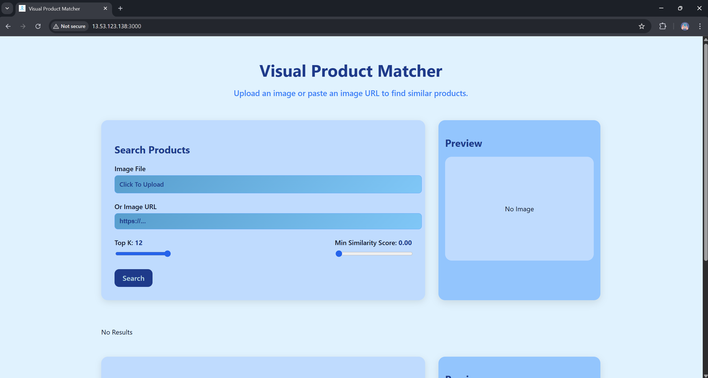

# 🎯 Visual Product Matcher

A full-stack **AI-powered product search engine** that allows users to **upload an image or paste an image URL** and instantly find visually similar products using **OpenAI’s CLIP model**.  

Built with:
- ⚡ **Backend:** Node.js + Express.js + Python (PyTorch + CLIP)
- 🎨 **Frontend:** React + Vite
- 📦 **Embeddings:** CLIP (ViT-B/32) + cosine similarity
- 🗄 **Data storage:** JSON-based product catalog + embeddings index

---
## Demo

[](https://drive.google.com/file/d/1Fd-kZUuq8wnYYJuoMW9QDcKgyBp8pomN/view?usp=sharing)


---

## 🚀 Features

- 🔍 **Visual Product Search:** Upload an image or paste a URL to search products by similarity.  
- 🎨 **Preview System:** Instant preview of uploaded image/URL.  
- 🛍 **Add New Products:** Add products with name, category, and image URL.  
- ⚡ **Automatic Index Rebuild:** New products are added to `products.json` and embeddings are automatically rebuilt for immediate availability.  
- 📊 **Configurable Search:** Adjust number of results (Top-K) and minimum similarity score threshold.  
- 🖼 **Cached Image Downloads:** Product images cached locally for efficiency.  
- 🖥 **Clean UI:** Modern React UI with responsive design and Tailwind-inspired CSS theme.  

---

## 📂 Project Structure

```plaintext
Visual-Product-Matcher-App/
│
├── backend/                      # Backend (Express.js + Python CLIP)
│   ├── data/                      # Data storage
│   │   ├── images_cache/          # Cached product images
│   │   ├── embeddings.json        # Precomputed embeddings
│   │   └── products.json          # Product catalog
│   │
│   ├── public/                    # Static fallback frontend
│   │   └── index.html
│   │
│   ├── uploads/                   # Uploaded images
│   │
│   ├── clip_model.py              # Python CLIP engine
│   ├── server.js                  # Express backend
│   ├── package.json               # Node.js dependencies
│   ├── package-lock.json
│   └── requirements.txt           # Python dependencies
│
├── frontend/                     # React Frontend (Vite)
│   ├── src/
│   │   ├── assets/                # Images / icons
│   │   ├── App.css                # Global styles
│   │   ├── App.jsx                # Main React app
│   │   ├── index.css              # Default styles
│   │   └── main.jsx               # React entry point
│   │
│   ├── index.html                 # Frontend entry
│   ├── package.json               # Node.js dependencies
│   ├── package-lock.json
│   ├── vite.config.js             # Vite configuration
│   ├── eslint.config.js
│   ├── .gitignore
│   └── README.md
│
├── Test_Images/                   # Sample images for testing
│
├── Architectural_Diagram.png      # High-level architecture diagram
└── README.md                      # Project documentation
```
---
## 🖼️ Architecture Overview


- **Frontend (React):**  
  User uploads/pastes an image → Sends request to backend → Displays search results.

- **Backend (Express.js + Python):**  
  Handles API requests → Calls `clip_model.py` → Computes embeddings → Returns results.

- **CLIP Model (Python):**  
  Encodes products + query → Computes cosine similarity → Finds top-K matches.

---

## ⚙️ Tech Stack & Purpose

### 🌐 Frontend
- **React (Vite)** → Provides a fast, modern, and reactive user interface. Vite enables lightning-fast hot reloading for development.  
- **Vanilla CSS (Tailwind-inspired theme)** → Custom CSS styled to look like Tailwind for clean, responsive, and modern UI components.  
- **ESLint** → Ensures code quality and consistent coding style in the frontend.  

### ⚡ Backend (Node.js)
- **Node.js + Express.js** → Lightweight server framework for handling API requests.  
- **Multer** → Middleware for handling `multipart/form-data` (file uploads).  
- **CORS** → Enables secure cross-origin requests from the frontend.  
- **Nodemon** (dev dependency) → Automatically restarts the backend server on code changes during development.  

### 🤖 Backend (Python + AI)
- **Python 3.x** → Used for heavy AI/ML processing alongside Node.js.  
- **PyTorch** → Deep learning framework to run OpenAI’s CLIP model efficiently.  
- **OpenAI CLIP** → Pretrained multimodal model for matching images and text.  
- **Pillow (PIL)** → Image preprocessing (resizing, opening, converting formats).  
- **NumPy** → Vector operations and embedding handling.  

### 🗄 Data & Storage
- **JSON files** (`products.json`, `embeddings.json`) → Lightweight data storage for product catalog and vector embeddings.  
- **Local file system** (`uploads/`, `images_cache/`) → Stores uploaded images and cached product images for efficiency.  

### 🛠 Development Tools
- **Git & GitHub** → Version control and collaboration.  
- **requirements.txt** → Manages Python dependencies for reproducibility.  
- **package.json** → Manages Node.js/React dependencies.  


---

## 🛠️ Installation Guide

Follow these steps to set up the **Visual Product Matcher** project on your local machine.

---

### 1️⃣ Clone the Repository
```bash
git clone https://github.com/<your-username>/Visual-Product-Matcher.git
cd Visual-Product-Matcher
```
### 2️⃣ Backend Setup (Node.js + Python)

The backend powers the API server (Node.js + Express) and runs the AI model (Python + CLIP).

---

#### 📌 Step 1: Navigate to the backend folder
```bash
cd Back-End
```
#### Step 2: Install Node.js dependencies
```bash
npm install
```
#### Step 3: Create Python Virtual Environment
```bash
python -m venv venv
```
#### Step 4: Activate the Environment
##### Windows (PowerShell)
```bash
.\venv\Scripts\Activate.ps1
```
##### Windows (CMD)
```bash
venv\Scripts\Activate1.bat
```
##### macOS/Linux
```bash
source venv/bin/activate
```
#### Step 5: Install Python Dependencies
```bash
pip install -r requirements.txt
```
✅The Backend will run on → http://localhost:5000

___

### 3️⃣ Frontend Setup (React + Vite)

The frontend provides the user interface for uploading/searching products and interacting with the backend API.

---

#### 📌 Step 1: Navigate to the frontend folder
```bash
cd Front-End
```

#### 📌 Step 2: Install Node.js dependencies
```bash
npm install
```

#### 📌 Step 3: Start the development server
```bash
npm run dev
```

✅The frontend will run by default on → http://localhost:5173

___

## 🧪 Testing the Application


You can test the system using sample images and backend microfrontend tools.


#### 📌 Test Images
- A set of **sample images** is provided in the `Test_Images/` folder.
- Use these images to verify that the visual search is working as expected.


#### 📌 Backend Microfrontend (API Testing)
- The backend serves a simple microfrontend at → [http://localhost:5000](http://localhost:5000)
- This page allows you to:
- Upload an image file and search similar products.
- Paste an image URL and run visual matching.
- Adjust search parameters (`Top-K` results, minimum similarity score).


#### 📌 Upload File or URL (Search Products)
- **File Upload**: Select an image file (e.g. from `Test_Images/`) and submit to search for similar products.
- **URL Upload**: Paste a valid image URL (e.g. from the web) and run the search.


#### 📌 Add Products
- Use the **Add Product Form** in the frontend.
- Enter:
- Product **Name**
- Product **Category**
- Product **Image URL**
- Once added, the product is stored in `products.json` and `embeddings.json` are **rebuilt automatically**.
- You’ll see a success message confirming the product addition and index rebuild.


---

## 🚀 Deployment

The **Visual Product Matcher** is deployed entirely on **AWS EC2 [ Free Tier ]** for full control of both frontend and backend.

- 🎨 **Frontend (React + Vite)** → Served on EC2 instance (port 3000).  
  🔗 Live: [http://visual-product-matcher](http://13.53.123.138:3000)

- ⚡ **Backend (Node.js + Express + Python CLIP)** → Running on the same EC2 instance (port 5000).  
  🔗 Live API: [http://visual-product-matcher](http://13.53.123.138:5000)

- 📦 **Data (products.json + embeddings.json + cached images)** → Stored locally on the EC2 instance for low-latency access.

### ⏱️ Latency Notes
- **Frontend → Backend (same EC2 machine):** Sub-10 ms internal latency.  
- **Client → EC2 (Internet):** Typically **100–250 ms**, depending on user’s region vs. EC2 region.  
- **End-to-End search (CLIP inference + cosine similarity):** ~1s for Top-10 results.

---


### 🌍 Project Highlights


- ⚡ **High Accuracy**: Built on OpenAI’s **CLIP (ViT-B/32)** model for reliable image-to-image matching.
- 🚀 **Fast & Efficient**: Embeddings cached locally enable real-time search with cosine similarity.
- 💾 **Lightweight Data Handling**: Products and embeddings stored in simple JSON for portability and reproducibility.
- 🔧 **Flexible & Extensible**: Easily add new product categories, datasets, or UI features to tailor for e-commerce or research.
- 🤝 **Community Ready**: Designed to welcome contributions, experiments, and improvements.


---


### 🌟 Final Notes


The **Visual Product Matcher** demonstrates how computer vision can be directly applied to real-world product discovery. Its combination of simplicity, speed, and adaptability makes it a strong foundation for:
- Academic research in visual similarity search.
- Prototyping AI-driven e-commerce systems.
- Building next-gen recommendation engines.
